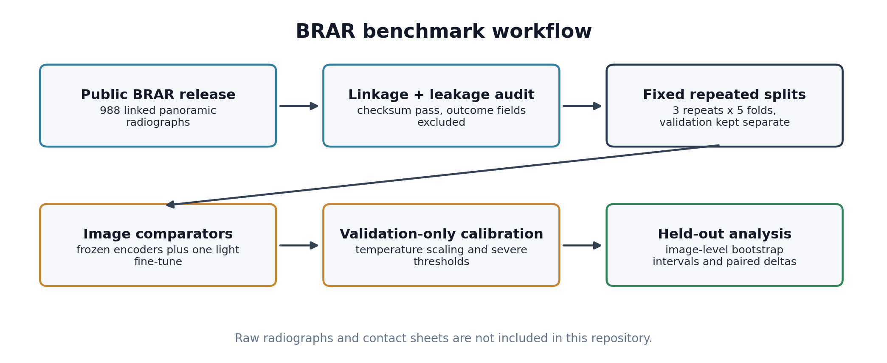
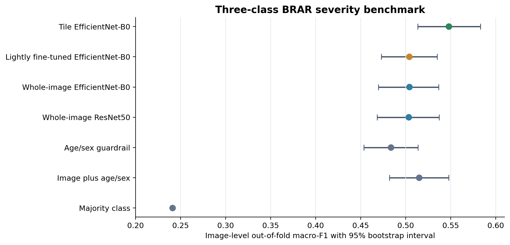
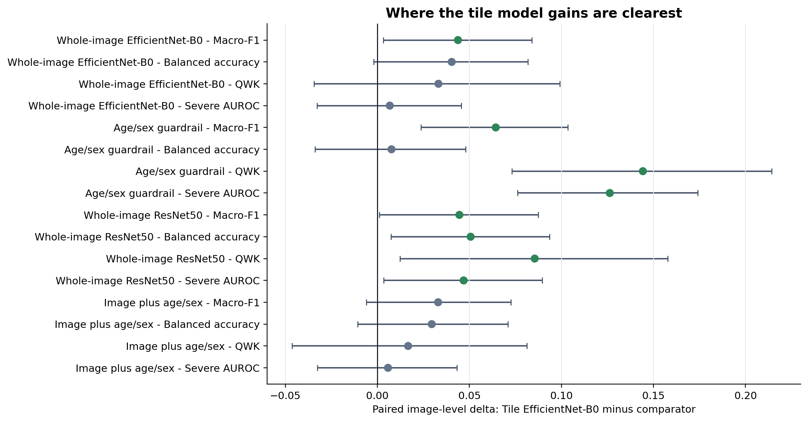

# BRAR Periodontal Radiograph Benchmark

A reproducible, leakage-aware machine-learning benchmark for predicting the released BRAR severity `Level` 1-3 target from panoramic radiographs in the public BRAR dataset, with negative-control baselines, calibrated probabilities, and image-level bootstrap comparisons.

**Status:** active - image-only baselines, one lightly fine-tuned comparator, and publication analysis pack available.

## Why This Exists

Most published dental-radiograph ML models report strong metrics but are hard to trust: splits leak related images across folds, "image" models quietly absorb metadata signal, and probabilities are uncalibrated. This project inverts the priorities - guardrails first, models second. Every model here is judged against a metadata confounding baseline, not just majority class, and every headline number carries an image-level bootstrap interval.

## Visual Overview

The visuals below are generated from public CSV outputs only. They do not contain raw radiographs or error-audit contact sheets.







## Results At A Glance

Aggregate test metrics across 15 repeated fold evaluations (3 repeats x 5 stratified folds):

| Model | Macro-F1 | Balanced accuracy | ECE (temp-scaled) |
| --- | ---: | ---: | ---: |
| **Tile EfficientNet-B0 (frozen, mean/max pooling)** | **0.5329** | **0.5399** | 0.0736 |
| Lightly fine-tuned EfficientNet-B0 (whole image) | 0.4850 | 0.5368 | 0.0655 |
| Whole-image EfficientNet-B0 (frozen) | 0.4928 | 0.5037 | 0.0930 |
| ResNet50 (frozen) | 0.4813 | 0.4798 | - |
| Age/sex metadata only (confounding guardrail) | 0.4850 | 0.5445 | - |
| Image + age/sex (sensitivity analysis) | 0.4981 | 0.5082 | - |

Secondary endpoint - severe grade (Level 3) vs lower: the lightly fine-tuned whole-image EfficientNet-B0 has the strongest image-only point estimate at balanced accuracy 0.6497 and AUROC 0.7069; tile EfficientNet-B0 remains the primary model for the pre-specified three-class macro-F1 endpoint.

**Honest read:** the tile-based image model has the best image-only macro-F1 point estimate and clearer image-level advantages on QWK. The fine-tuned comparator helps answer the reviewer question about whether a lightly trained CNN changes the story: it improves balanced accuracy over the frozen whole-image EfficientNet-B0 and improves severe-grade point estimates, but it remains below the tile model on paired macro-F1 and does not raise the primary three-class benchmark. Age/sex balanced accuracy is numerically slightly higher than the tile model's cross-validation balanced accuracy. This is a rigorous benchmark with honest uncertainty, not a high-performance clinical model, and it is not framed as one.

## What Makes The Benchmark Trustworthy

- **Leakage audit before any modeling** - predictor/outcome policy and codebook-variable leakage rules ([reports/leakage_audit.md](reports/leakage_audit.md)).
- **Split integrity** - repeated stratified 5-fold design (fixed seeds `20260606`-`20260608`); exact-duplicate hashes grouped so they cannot cross folds; near-duplicate audit found no high/medium candidates crossing fold groups.
- **Negative controls** - administrative filename/index control (macro-F1 0.1929) and image geometry/file-size control (0.3044) confirm no shortcut signal; age/sex metadata (0.4850) and a downstream dental-status upper bound (0.5063) set the bar any image model must clear.
- **Calibration reported, not ignored** - validation temperature scaling, with ECE reported alongside discrimination metrics.
- **Image-level bootstrap intervals and paired model comparisons** for manuscript-ready claims ([reports/publication_ready_model_table.csv](reports/publication_ready_model_table.csv)).
- **Error audit** - 698 flagged test-error images ranked for review, prioritizing severe Level 3 cases predicted as Level 1-2, with visual contact sheets kept out of the public repo.

## Dataset

Public BRAR-anchored panoramic radiograph dataset (Figshare file id `58062268`, MD5-verified):

- Expected and observed MD5: `4df0368a88f23f403958e6b371057f11`.
- The inspected public full ZIP contains 988 JPEG images and one 988-row metadata CSV.
- Important release discrepancy: the source data descriptor describes a richer 1,104-patient cohort, but the inspected public full ZIP contains 988 linked images/metadata rows. The 988-image benchmark size reflects the inspected public release, not an investigator-applied exclusion.
- Released image-level severity labels: Level 1 = 170, Level 2 = 560, Level 3 = 258.
- Linkage key is the anonymized image filename; the public ZIP does not include the tooth-level annotation tables described in the source article, so the benchmark is deliberately scoped to image-level prediction (see [reports/GO_NO_GO.md](reports/GO_NO_GO.md)).
- Raw images are **not** redistributed in this repository - `data/raw/` and `data/extracted/` are gitignored and regenerated from Figshare.

**Dataset citation:** Xia Y, Li Z, Lin Z, Wang S, Wang Y, Xie Y. *BRAR-anchored multimodal dataset*. Figshare; 2025. DOI: [10.6084/m9.figshare.30155974.v3](https://doi.org/10.6084/m9.figshare.30155974.v3) (CC BY 4.0).

## Reproduce

```bash
python3 -m venv .venv && source .venv/bin/activate
pip install -r requirements-training.txt

# Feasibility + guardrails
python3 scripts/build_feasibility_reports.py
python3 scripts/01_build_manifest.py
python3 scripts/02_make_splits.py
python3 scripts/04_audit_splits_and_near_duplicates.py
python3 scripts/05_run_negative_control_baselines.py

# Baselines
python3 scripts/08_train_frozen_image_baseline.py
python3 scripts/09_evaluate_image_baseline.py
python3 scripts/14_train_tile_efficientnet_baseline.py
python3 scripts/17_train_lightly_finetuned_cnn.py
python3 scripts/09_evaluate_image_baseline.py --predictions data/processed/image_baseline/fine_tuned_efficientnet_b0_384x192_predictions.csv --output-prefix image_baseline_fine_tuned_efficientnet_b0_384x192

# Publication analysis
python3 scripts/11_analyze_publication_strength.py
python3 scripts/15_publication_uncertainty_and_error_audit.py
python3 scripts/16_generate_readme_visuals.py
```

Numbered scripts (`01`-`17`) run the full pipeline in order; each renders a static HTML/Markdown report, CSV prediction artifact, or public-safe visual output. Training ran locally on Apple Silicon (`mps`) with frozen ImageNet encoders plus one lightly fine-tuned EfficientNet-B0 comparator - no GPU cluster required.

<details>
<summary><strong>Repository map</strong></summary>

- `scripts/01-17_*.py` - manifest -> splits -> audits -> negative controls -> frozen baselines -> tile model -> fine-tuned comparator -> publication analysis -> README visuals.
- `data/processed/` - model-ready manifest, split assignments, fingerprints, predictions (CSV only; large arrays gitignored).
- `reports/` - audit trails and browser-viewable reports: data linkage, leakage policy, GO/NO-GO, split report, guardrail report, per-model summaries, publication strength, uncertainty and error audit.
- `docs/assets/` - public-safe README diagrams and charts generated from result CSVs.
- `requirements-training.txt` / `.lock.txt` - pinned local training environment.
- [WORKING_NOTES.md](WORKING_NOTES.md) - detailed working notes: full file inventory, rebuild commands, checkpoint sequence, and result log.

</details>

## Publication Framing Caveats

- The released `Level` target is a BRAR-derived grade, not an independent clinical periodontitis-stage diagnosis. Do not equate BRAR grades with 2017 World Workshop periodontitis stages.
- The primary image-only benchmark remains the frozen tile EfficientNet-B0 model. The lightly fine-tuned EfficientNet-B0 is a single same-split comparator, not an architecture search or proof of clinical deployment readiness.
- Whole-image comparators use 384 x 192 aspect-fit inputs, while the leading tile model uses four 384 x 384 horizontal tiles. The fine-tuned model therefore tests a practical whole-image fine-tuning comparator, not a clean isolation of fine-tuning from image representation or effective resolution.
- The pre-specified primary three-class metric for manuscript framing is macro-F1. Other paired metrics and subgroup intervals should be interpreted as secondary or exploratory.
- Because the BRAR-derived target is age-dependent, age/sex is a necessary metadata guardrail, not merely a convenience comparator.
- Image-level out-of-fold estimates average each image's three test appearances from repeated cross-validation; they are repeat-aware benchmark summaries rather than single-shot deployment estimates.

## Roadmap

1. Improve image-only signal under the same guardrails.
2. Complete clinician-facing manual review of severe false negatives and two-grade errors.
3. Manuscript: reproducible, leakage-aware, calibrated BRAR benchmark with explicit metadata-confounding analysis.

## Author

Francisco Teixeira Barbosa - periodontist; founder of [Periospot](https://periospot.com); Executive Director, [Foundation for Oral Rehabilitation](https://www.for.org).

Part of a broader line of work on evidence-grade AI for dentistry: [dental-ai-skills](https://github.com/Tuminha/dental-ai-skills) · [llm-evaluation-for-dentistry](https://github.com/Tuminha/llm-evaluation-for-dentistry) · [dental-evidence-triage](https://github.com/Tuminha/dental-evidence-triage)
